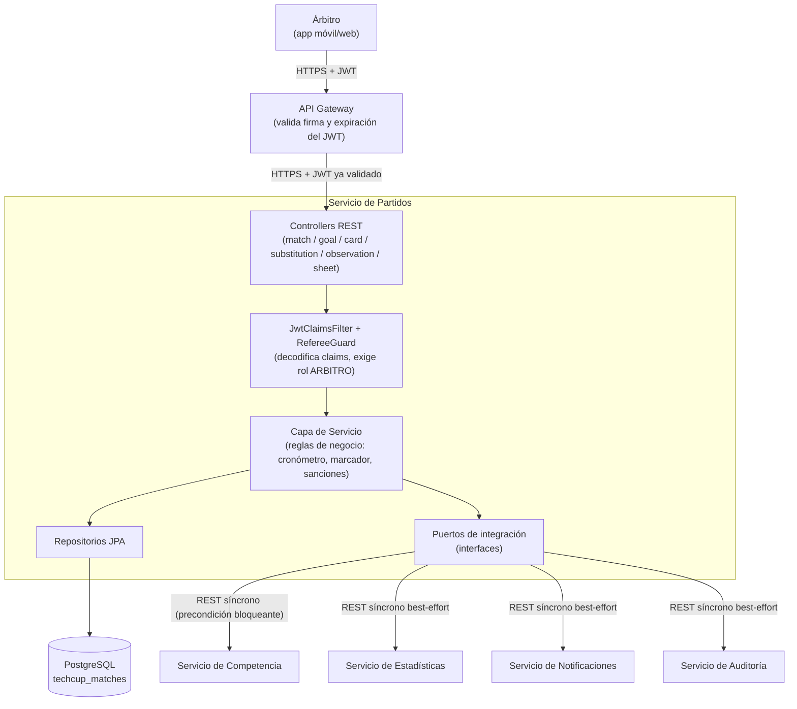
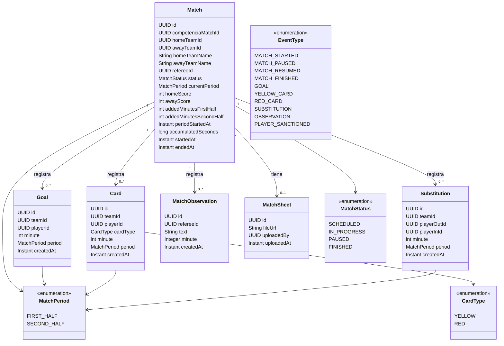
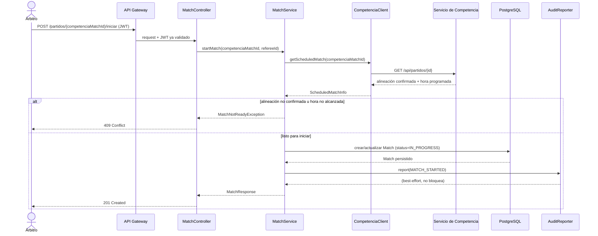
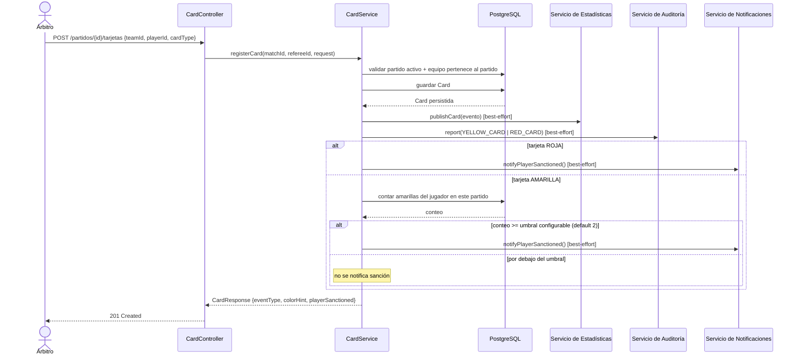
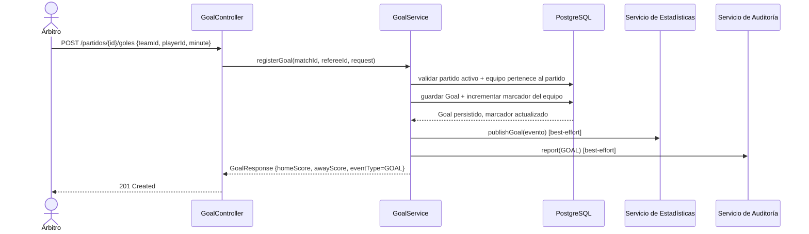

# Diagramas — Servicio de Partidos

## 1. Componentes generales

Vista de alto nivel: el árbitro nunca llega directo a este servicio (todo pasa por
el API Gateway), y este servicio nunca llama directo a otro microservicio de
negocio salvo a través de sus puertos de integración.

**Por qué el Gateway está en el camino crítico:** este servicio decodifica los
claims del JWT pero **no verifica su firma** — asume que solo el Gateway puede
alcanzarlo. Por eso no debe exponerse directo a internet (ver [Seguridad](#seguridad)
en el README).

---

## 2. Clases (modelo de dominio)

`EventType` no es una columna persistida en estas entidades: es el código que
cada `*Response` DTO expone junto al color sugerido, para que ninguna alerta
dependa solo de color (accesibilidad daltonismo).

---

## 3. Secuencia: iniciar partido

Precondición bloqueante: si Competencia no confirma la alineación o el horario
programado no ha llegado, el partido no inicia.

---

## 4. Secuencia: registrar tarjeta (con regla de sanción)

---

## 5. Secuencia: registrar gol

